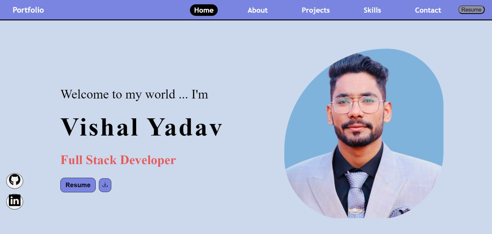

<h2>About the project</h2>

  
A <b>Portfolio</b> website to reflect your accomplishment, skills, experiences and attributes. It highlights and
showcases samples of some of your best
work, along with life experiences, values
and achievements. 

👉 Live Demo: <a href='#'>Live Demo</a>

<h3>Build with:</h3>

» Sass / Scss  
» React JS

<h2>Screenshots of the Portfolio 📸</h2>
 
<h3 align='center'>Home Page 🏡</h3>

